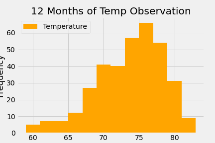

# sqlalchemy_climate_analysis
To begin, use Python and SQLAlchemy to do basic climate analysis and data exploration of your climate database. 

The start date was completed two ways in the Visual Studio; 
    the 1st way compiles the Min, Max, and Avg temp for every single day from the start date to the last date of the data.
    the 2nd way finds the Min, Max, and Avg temp for range of days from the date given(start).

'USC00519281' is the most active station, according to the data, but when gathering the last 12 months of temperature observation data from the station, the lastest date on record is different than the date being used previously for the precipitation data.

The average temperature for Hawaii during September, 10th and 20th in 2016 was 77 degrees Fahrenheit, with an error bar of 13 degrees.
[70.0, 77.17391304347827, 83.0]

When using all the temperature data collected for Hawaii on those dates the average temp. is 76.3, only slightly lower than the 2016 data.
The average minimum temp. is 68 degrees and the average maximum temp. is 84 degrees.

            Tmin       Tavg       Tmax
count  11.000000  11.000000  11.000000
mean   68.272727  76.320566  84.000000
std     1.103713   0.473480   1.788854
min    67.000000  75.851064  81.000000
25%    67.500000  75.939364  83.000000
50%    68.000000  76.145833  84.000000
75%    69.000000  76.594584  85.000000
max    70.000000  77.403846  87.000000
